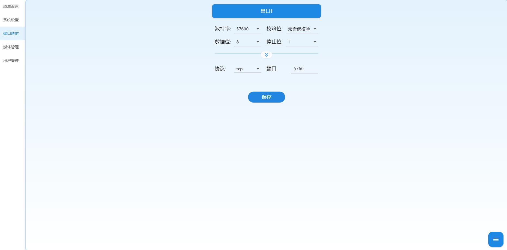

# 简介

这是一款专为 **树莓派 Zero W 和 Zero 2W** 设计的**开源免费**软件方案，将您的树莓派Zero W/2W变身为高清图传、数据遥测、本地录像三合一终端！

## 核心功能

* 双模网络 : 支持 AP热点模式（自建WiFi网络）与 Station客户端模式（接入现有网络）

* 全兼容视频输入 ：支持原生驱动树莓派CSI摄像头及标准USB摄像头，自动识别H.265/H.264/MJPEG编码协议
* 智能本地录像 :  双通道并行录制，支持自定义切片时长。
* 深度适配飞控生态 ：无缝对接地面站软件QGroundControl (QGC) 和 Mission Planner。
* 超低延时播放(专业版) : 配带自研极速播放器。
* 数传透传 : 串口↔TCP/UDP双向数据映射。
* 轻量级 : 卡片级大小，易于嵌入。
* 低功耗 : 5V供电超低功耗，支持移动电源供电。

# 镜像下载地址

通过网盘分享的文件：图数一体
链接: https://pan.baidu.com/s/1uwm1LzYDT1aV84J6RmZ04g 提取码: ig62

下载镜像后解压，使用Win32DiskImager工具将镜像写入SD卡，在将SD卡插入树莓派即可。

第一次启动速度较慢中间会重启一次初始化设备，启动成功后，会搜索到默认热点ap_imgwifi.

树莓派系统的默认用户名是pi，默认密码是raspberry。

# 连接

设备初始模式是热点模式，默认热点名称: ap_imgwifi,默认热点密码: 12345678，默认ip地址: 192.168.1.1。使用wifi连接该热点，连接成功后在web端访问。

即访问:  http://192.168.1.1/

# 登录

默认用户名： admin 默认密码：admin


# 热点设置

* **在Ap模式和Sta模式中均可设置热点信息，Ap模式设置完成后即可生效，Sta模式在切换回Ap模式后也可生效。**


* 选择网卡：默认即可

- ip地址： 设置设备ip地址
- 网关： 设置设备网关
- 子网掩码：设置设备子网研发
- 热点名称：设置设备热点名称
- 热点密码：设置设备的热点密码
- 信道选择： 设置设备的信道


# 端口映射

将图数一体的串口数据使用tcp或udp的方式进行透传。



1. 配置串口的 波特率、校验位、数据位、停止位。
2. 配置协议支持tcp和udp的通信方式，选择好协议后指定端口。


在树莓派zero w和树莓派zero 2w中串口1代表图片中红色方框内的TxD和RxD

# 媒体管理

**媒体管理分为两个部分，一个是摄像头选择配置，另一个是视频录像**


* 摄像头类型分为：csi摄像头和usb摄像头，推荐使用csi摄像头
  * csi摄像头：树莓派支持的csi摄像头均可。
  * usb摄像头：优先选择支持h264编码和h265编码的摄像头，最次选择支持mjpeg的摄像头，其他摄像头不支持。
* 视频头录像：开启录像功能，选择切片时长，将摄像头流地址拷贝到录像地址1或录像地址2即可。
  * 支持同时两路录像，录像地址都为空，则不录像。
  * 支持csi摄像头录像和usb支持h264编码和h265编码的摄像头，不支持mjpeg摄像头录像。

# 配置文件详解

将sd卡读卡器插入电脑，配置文件在overlays文件夹下，配置文件名imgwifi.ini。


配置文件内容：

```ini
# 网络配置部分
# enable_ap_mode: 是否启用AP模式
# true  - 设备将作为WiFi热点
# false - 设备将作为WiFi客户端连接到其他网络
[Network]
enable_ap_mode = false

# WiFi客户端配置部分,在enable_ap_mode为false的时候生效
# ssid: 要连接的WiFi网络名称
# password: 对应WiFi网络的密码
# 注意：如果ssid或password为空，设备将自动切换到AP模式
[WiFi_Client]
ssid     = MyWiFi
password = MyPassword123

# 系统配置部分
# reset_default: 是否恢复默认设置
# true  - 下次启动时将恢复所有参数为默认值
# false - 保持当前配置不变
# expand_filesystem: 是否扩展树莓派的文件系统
# true  - 下次启动时将扩展文件系统以使用SD卡全部容量
# false - 保持当前文件系统大小不变
[System]
reset_default     = false
expand_filesystem = false

```

* 如果想将设备作为热点使用修改enable_ap_mode = true即可。
* 如果想将设备作为WiFi客户端连接到其他网络，enable_ap_mode = false，并且在WiFi_Client中配置对应wifi的名称和密码。

**注：如果系统设置后导致无法启动，可以取出sd卡修改配置文件中的reset_default = true，重新插上sd卡上电即可恢复默认参数。**

# 系统更新

非专业人事请误操作。

将需要更新的文件放在ImgwifiUpdateApp目录里,上电后设备会自动重启更新。


# QGroundControl

**接线**


**配置数传**

我们连接的设备是一款开源飞控pixhawk2.4.8，该串口的波特率是57600，所以我们配置图传的的波特率为57600，选择映射的协议，这里我们选择tcp或udp，端口随便填和后面地面站里填写的端口保持一致即可。

以下tcp协议的端口被系统占用，请勿填写：【22，554，80，88，6808，1935，8080】

QGroundControl中配置图传地址，因为我的图传地址改过是192.168.2.104，根据实际图传填写，默认是192.168.1.1。端口号和上面映射出来的保持一致。


**配置视频流**

选择视频-》source选择Rtsp Video Stream-》rtsp url，将摄像头流地址复制过去即可（除了mjpeg格式其他都支持）


配置完成


# MissionPlaner

**配置数传**

我们连接的设备是一款开源飞控pixhawk2.4.8，该串口的波特率是57600，所以我们配置图传的的波特率为57600，选择映射的协议，这里我们选择tcp或udp，端口随便填和后面地面站里填写的端口保持一致即可。

以下tcp协议的端口被系统占用，请勿填写：【22，554，80，88，6808，1935，8080】

MissionPlaner根据图传的配置选择协议，填写ip地址，因为我的图传地址改过是192.168.2.104，根据实际图传填写，默认是192.168.1.1。


配置端口，和图传设置的一致即可


**配置视频流**

右键单击，选择video->Set GStreamer Source


按照如下格式填写视频流地址，将图传中的视频流地址替换掉location=后面的rtsp://192.168.2.104/cam

csi摄像头或者usb摄像头的H264格式

```
rtspsrc location=rtsp://192.168.2.104/cam latency=0 ! rtph264depay ! h264parse ! avdec_h264 ! videoconvert ! video/x-raw,format=BGRA ! appsink name=outsink
```

usb摄像头的H265格式

```
rtspsrc location=rtsp://192.168.2.104/cam latency=0 ! rtph265depay ! h265parse ! avdec_h265 ! videoconvert ! video/x-raw,format=BGRA ! appsink name=outsink
```

根据设备不同替换location里面内容即可播放


配置完成


# 自带播放器

该播放器不支持开源版本，需要升级专业版。

配置图传ip和视频流地址点击保存，支持rtsp视频流和mjpeg视频流。


# 联系作者

[专业版](./开源版本与专业版本区别.md)

支持定制

码云：https://gitee.com/daimaxiuligong/raspberry_image

github: https://github.com/daimaxiuligong/raspberry_image


